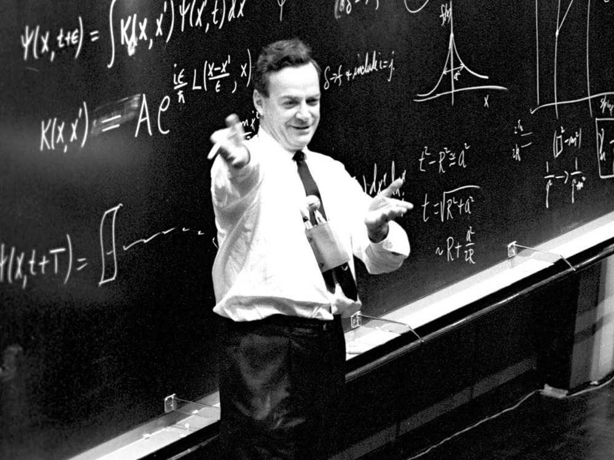

> *If you can't explain something in simple terms, you don't understand it - Richard Feynmann*

I believe I possess the skill of digesting complex subjects and delivering them in simple terms for technical and non-technical audiences.

If you organize an event that you'd like me to attend (and are able to cover travel & stay) I'd happily contribute to it. [Get in touch](mailto:me@gakonst.com).

# Past Talks:

### Plasma Cash: Towards improved Plasma Constructions 
1. [Stanford Blockchain Conference - Palo Alto, California](https://youtu.be/9nD1elfVshc)
2. [MIT Bitcoin Expo - Boston, Massachussets](https://youtu.be/ZQg_IckcvNI) (features ideas for Plasma on Bitcoin)
3. [Ethereum Devcon4 - Prague, Czech Republic](https://slideslive.com/38911960/plasma-cash-towards-improved-plasma-constructions)
4. [ETHDenver - Denver, Colorado](https://www.youtube.com/watch?v=lSZp9zKh418)
5. [EthCC - Paris, France](https://youtu.be/i_3tuT82MWo) (features Plasma Cashflow explanation)
6. [Blockchain Game Summit - Lyon, France](https://www.youtube.com/watch?v=mKMMohb_FVU)
7. [Bit.fish Labs meetup - Bangkok, Thailand](https://youtu.be/2-9oGP0swAs)

### Other:
1. Everything You wanted to know about Plasma but were afraid to ask, Ethereal Summit - New York City, New York
2. Scaling Blockchains, Techstars NYC - New York City, New York
3. [Delegated Proof of Stake Sidechains](https://www.meetup.com/DeFiNYC/events/259495486/), DeFi NYC - New York City, New York

## Workshops, Panels and Podcasts:
1. [The Future of Layer 2, Paralelni Polis - Prague, Czech Republic](https://www.youtube.com/watch?v=Akl70GiUcl8&feature=youtu.be&t=2776)
2. [Plasma Researchers' panel, Devcon4 - Prague, Czech Republic](https://slideslive.com/38911962/plasma-implementers-call-live)
3. [Working with Layer2 panel, ETHDenver - Denver, Colorado](https://www.youtube.com/watch?v=l1EL_nKpkKA)
5. [Introduction to Ethereum and Solidity Development, Bitcoin & Blockchain meetup - Thessaloniki, Greece](https://www.meetup.com/BlockchainGreece-1/events/247215219/)
6. [Scaling with Plasma, Bitcoin & Blockchain meetup - Thessaloniki, Greece](https://www.meetup.com/BlockchainGreece-1/events/255022053/)
7. Plasma 101, Neutrino Blockchain Meetup - Tokyo, Japan (remote presentation)
8. [The Smartest Contract Episode 9: Plasma](https://www.thesmartestcontract.com/9)
9. [The Bitcoin Podcast - Hashing it Out Episode 33, Plasma Cash](https://thebitcoinpodcast.com/hashing-it-out-33/)
10. [Into the Ether: Scaling Ethereum with Plasma](https://podcast.ethhub.io/scaling-ethereum-with-plasma-georgios-konstantopoulos-of-loom)
11. [RSA Accumulators for UTXO History Compaction, Zero Knowledge Study Club](https://youtu.be/tqqsbsAHJzs)
12. [Plasma Implementers' Calls](https://www.youtube.com/channel/UCG2MeKuKDJRK4gFNk-dQuZQ/videos)
